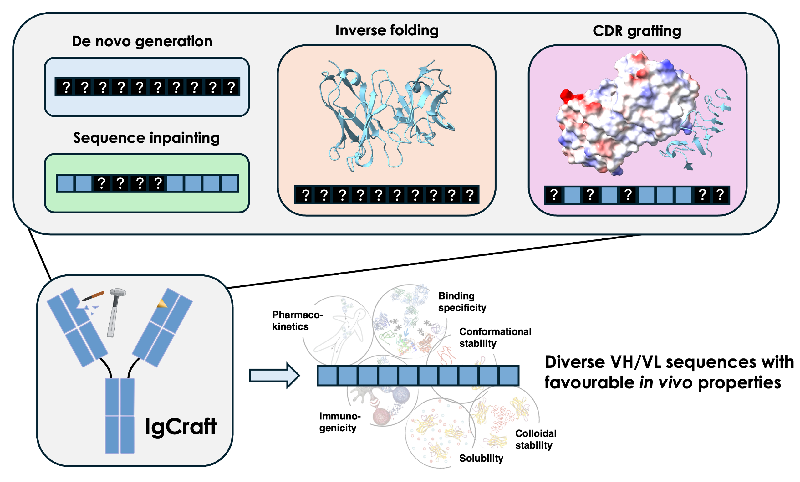

# IgCraft: A versatile generative model for paired human antibody sequences


[](https://arxiv.org/abs/2503.19821)



IgCraft is a human antibody sequence generative model that can perform a both unconditional and conditional sampling
and flexibly condition on structural data. Specifically we demonstrate that the model achieves competitive performance
on the following tasks:

- **Unconditional generation**: Generate paired human antibody sequences from scratch.
- **Sequence inpainting**: Conditionally generate arbitrary IMGT region sequences (H-cdr1, H-fwr3, L-cdr3, etc.) given the remaining regions.
- **Inverse folding**: Conditionally generate full length VH/VL sequences given an input structure.
- **CDR grafting**: Conditionally generate (humanised) framework sequences given an input set of CDR structures.

IgCraft excels particularly at generating antibody sequences with a favourable humanness profile.

## Environment setup

To setup the virtual environment use the `environment.yml` file. We recommend using `mamba`. If you don't have
`mamba` installed, install it in your **base environment** using the following command:

```bash
conda install conda-forge::mamba
```

Then create the virtual environment using the following command:

```bash
mamba env create -f environment.yml
```

Finally you'll need to `pip install` the package itself after activating the environment:

```bash
conda activate igcraft
pip install -e .
```

## Downloading weights and data

The easiest way to download the model weights is via huggingface. You can install the weights and config
(from the conda environment) with:

```bash
huggingface-cli download mgreenig/IgCraft igcraft-model/checkpoints/final.ckpt --local-dir .
huggingface-cli download mgreenig/IgCraft igcraft-model/.hydra/config.yaml --local-dir .
````

Once the model weights are downloaded, an `igcraft-model` directory should be created in the current 
directory. The default model checkpoint paths in the configs point directly to this file. 

A more complete set of model weights (including weights after pre-training/before fine-tuning) 
and train/test data can also be downloaded from [here](https://zenodo.org/records/15077225).

To obtain the test data we used for model evaluation, just run:

```bash
wget https://zenodo.org/records/15077225/files/test-data.zip && unzip test-data.zip
```

Unpacking the test data should create a directory called `data` in the current directory.
All the default configs for the inference scripts point to the data paths in this directory.

## Running inference with IgCraft

### Configuration

IgCraft uses [hydra](https://hydra.cc) to specify configuration options. The relevant configuration
files for the four tasks are located in the `configs` directory:

- `sample.yaml`
- `inpaint.yaml`
- `inverse_fold.yaml`
- `graft_cdrs.yaml`

By default, the dataset arguments in the configs default to the paths of the test data after it is unpacked
from the `data.zip` file.

When running the scripts for each task, hydra will create a run directory with the input run name 
in which the output data from the script will be saved. 

### Unconditional generation

To generate paired human antibody sequences unconditionally:

```
python scripts/sample.py n_sequences=2000 run_name=unconditional
```

### Sequence inpainting

To conditionally generate arbitrary IMGT region sequences, the model requires a CSV file as input (see `data/inpainting/test_sequences.csv` 
for an example). To generate this file format from a FASTA file of paired sequences (with the format `<VH sequence>:<VL sequence>` in
each sequence field), we provide the following utility script:

```
python scripts/data/fasta_to_csv.py /path/to/my/fasta --cores 4 --outfile alignment.csv
```

This script will create a CSV file called `alignment.csv`. Then, to run inpainting:

```
python scripts/inpaint.py sequences_csv=alignment.csv run_name=inpainting
```

### Inverse folding

The inverse folding script can be run on a single PDB file or a directory of PDB files:

``` 
python scripts/inverse_fold.py pdb_path=/path/to/pdb run_name=inverse_fold
```

The output of inverse folding is a CSV file containing the predicted/wild-type sequence for IMGT region.

### CDR grafting

The CDR grafting script also takes a single PDB file or a directory of PDB files as input:

```
python scripts/graft_cdrs.py pdb_path=/path/to/pdb run_name=graft_cdrs
```

The output of CDR is a CSV file containing the wild-type sequence for each IMGT region and the generated
sequences for the framework IMGT regions, as well as a FASTA file containing the wild-type CDR sequences
grafted into the generated framework sequences.

By default, CDR grafting generates framework sequences conditional only on the input CDR sequences and structures.
You can also condition on the structure of the framework regions by passing the argument `use_fwr_structure=true`.

## Training IgCraft

To train IgCraft, you can use the `train.py` script. You'll need to specify a `config-name`, which points
to a YAML file in the `config` directory. We include the following configs for the different stages of training:

- `train_structures.yaml` - Fine-tuning on paired antibody structures in HDF5 format
- `train_paired.yaml` - Fine-tuning on paired antibody sequences in CSV format
- `train_unpaired_vh.yaml` - Pre-training on VH sequences in CSV format
- `train_unpaired_vl.yaml` - Pre-training on VL sequences in CSV format

To obtain the training data we used, run:

```bash 
wget https://zenodo.org/records/15077225/files/train-data.zip && unzip train-data.zip
```

The training data is ~15Gb so this can take a while!

By default, the dataset paths in the config files above point to the relevant path in the unzipped
`train-data` directory. 

You can also use your own data, but it needs to be formatted correctly!

We format sequence datasets as CSV files with columns `{region}_aa_{chain_type}` where `{region}` is the 
variable region (e.g. `fwr1`, `cdr1`, etc.) and `{chain_type}` is either `heavy` or `light`. Each column
contains the region sequence for the corresponding sequence, and different rows correspond to different
sequences. **We also include an example of this format in the `data` directory unpacked from `test-data.zip`,
under `data/inpainting/test_sequences.csv`.**

For structural data, we use a specific HDF5 format. To obtain an HDF5 file for an input directory of PDB files, 
use our utility script:

```bash
python scripts/data/pdbs_to_hdf5.py /path/to/pdb/dir --cores 4 -o structures.hdf5
```

Then, adjust the `model.datamodule.cfg.train_dataset` and `model.datamodule.cfg.val_dataset` fields in the 
relevant config file. 

There is also a `wandb` field that can be filled in with your project's details.

Then, run training with (e.g. for structure finetuning):

```bash
python scripts/train.py --config-name train_structures
```
